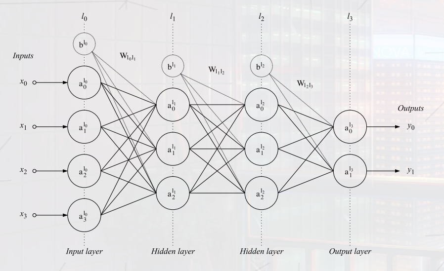
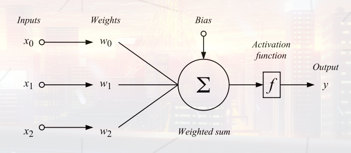
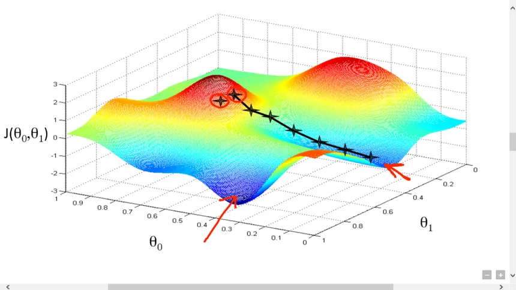
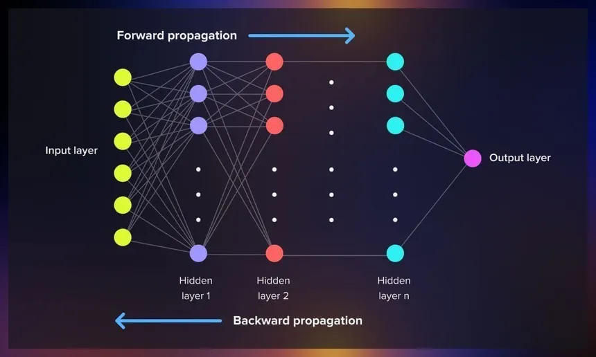

# MultiLayer-Perceptron

##### A  *Multilayer Perceptron* is an artificial neural network composed of layers of *perceptrons*, based on a *feedforward* architecture. Each *perceptron* performs arithmetic operations with previously defined *weights* plus a fixed *bias* term, and applies a *nonlinear* *activation function*.

---------------------------------------------------

For the *learning* process, used to increase the accuracy of our multilayer, we employ *gradient descent*: the parameters *(weights and biases)* are updated in the direction of steepest descent of the *loss surface*.

---------------------------------------------------

The gradients of the loss with respect to each parameter are computed using the *backpropagation algorithm*, which applies the chain rule of calculus recursively from the *output layer* back to the *input layer*, updating parameter values to increase the accuracy of the neural network.

---------------------------------------------------
Each complete pass over the training dataset constitutes one epoch.

## Objectives & Requirements

The project requires implementing from scratch a **Multilayer Perceptron** for binary classification on the **Wisconsin Breast Cancer Dataset**.

### Dataset
- **Source**: Wisconsin Breast Cancer Diagnostic dataset (`.csv` file)
- **32 columns**: ID, diagnosis (`M`/`B`), and 30 numerical features extracted from cell nuclei
- Requires **preprocessing** (normalization, handling missing values)
- Must be split into **training set** and **validation set**

### Mandatory Implementation

The program must support three modes (or three separate programs):

| Mode | Purpose |
|------|---------|
| **Split** | Partition the dataset into training and validation sets |
| **Train** | Learn weights using backpropagation and gradient descent, then save the model |
| **Predict** | Load saved weights, run a forward pass on new data, evaluate with binary cross-entropy |

### Architecture Requirements

- **Input layer**: 30 neurons (one per feature)
- **Hidden layers**: Minimum **2 dense layers** (default: 24 neurons each), activation: `sigmoid`
- **Output layer**: 2 neurons, activation: `softmax` (mandatory — outputs probability distribution)
- **Weights initializer**: `heUniform` (or similar)

### Training Requirements

- **Loss function**: `categoricalCrossentropy` during training, `binary cross-entropy` for final evaluation
- **Optimization**: Gradient descent with configurable `learning_rate`
- **Metrics**: Loss and accuracy displayed per epoch for both training and validation sets
- **Learning curves**: Two graphs at the end — loss over epochs and accuracy over epochs
- **Hyperparameters**: Configurable via file or CLI arguments (layers, epochs, batch size, learning rate)

### Deliverables

- Modular code (add/remove layers easily)
- `Makefile` with standard rules (if compiled language)
- Model saved as serialized weights (e.g., `.npy` file)
- No neural network libraries allowed — only linear algebra and plotting libraries permitted
